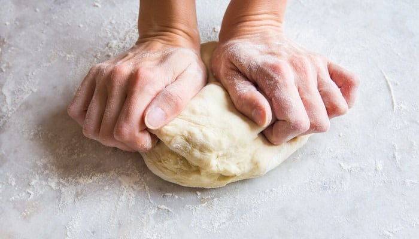
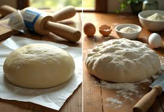
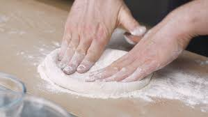
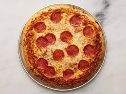
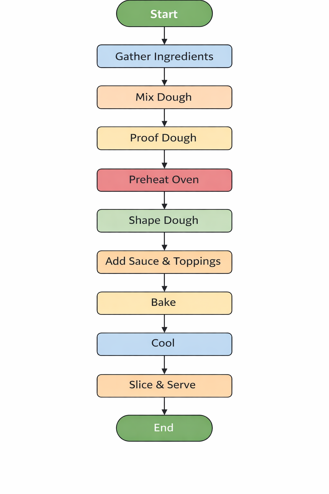

# Standard Operating Procedure for Preparing a Homemade Pizza in a Residential Kitchen
**Author: Group 5**
**Reviewer: Felix**
**Date: April 1, 2026**
**Version: 1.0**

## Approval Table 

| Name    | Role     | Signature | Date         |
|---------|----------|-----------|--------------|
| Group 5 | Author   |           | April 1, 2026 |
| Felix   | Reviewer |           |              |

## Revision History 
| Version | Date         | Description               | Author   |
|--------|--------------|---------------------------|----------|
| 1.0    | April 1, 2026 | Initial document creation | Group 5  |

## 1. Overview
### Purpose
The purpose of this document is to outline the standardized procedure for preparing a homemade pizza to ensure consistency, quality, and food safety. 

### Scope 
This procedure applies to individuasl preparing pizza using standard kitchen equipment in a residential setting. The objective is to ensure consistent results.

## 2. Accountability Matrix (RACI)

| Task                    | Responsible (R) | Accountable (A) | Consulted (C)      | Informed (I)      |
|-------------------------|----------------|------------------|--------------------|-------------------|
| Gather ingredients      | Prep Cook      | Head Cook        | Household Members  | —                 |
| Prepare dough           | Prep Cook      | Head Cook        | —                  | Household Members |
| Preheat oven            | Prep Cook      | Head Cook        | —                  | —                 |
| Shape dough             | Prep Cook      | Head Cook        | —                  | —                 |
| Add sauce & toppings    | Prep Cook      | Head Cook        | Household Members  | —                 |
| Bake pizza              | Prep Cook      | Head Cook        | —                  | Household Members |
| Cool and slice pizza    | Prep Cook      | Head Cook        | —                  | Household Members |
| Clean workspace         | Prep Cook      | Head Cook        | —                  | Household Members |

* The Accountability Matrix defines roles and responsibilities to ensure each step of the process is completed efficiently and consistently.

## 3. Safety 
* Wash hands before handling food
* Use oven mitts when handling hot trays
* Avoid contact with hot surfaces
* Ensure proper food hygiene practices

## 4. Step-by-Step Guide 
### Step 1: Ingredients 
* Gathering all the ingredients beforehand ensures efficiency
* 500g bread flour
* 325 ml warm water
* 10g salt
* 3g active dry yeast
* Tomato sauce, cheese, and toppings of choice

### Step 2: Dough Mixing and Kneading 
* Combine flour, yeast, warm water, and salt in a mixing bowl
* Knead the mixture for 8 - 10 minutes until a smooth dough forms
* Proper kneading gives the crust its structure

*Figure 1: Dough being kneaded until smooth and elastic*

### Step 3: Proof the Dough 
* Place the dough in a bowl coated with teaspoon of oil
* Cover the bowl with a plastic wrap or a damp towel
*  Let the dough sit in a warm spot for 90 - 120 minutes or unti it has doubled in size

 *Figure 2:Proofing of the dough*

### Step 4: Preheat the Oven 
* Preheat the over to
* A properly heated oven ensures even cooking and a crisp crust

### Step 5: Shape the Dough 
* Divide the dough, and gently press it into a circular shape using your fingertips
* Avoid using a rolling pin excessively, as it may

*Figure 3: Shaping of the dough with fingertips*

### Step 6: Add Sauce 
* Spread a thin layer of tomato sauce evenly over the dough.
* Leave a small border around the edges.
* This prevents sogging, and maintains the crust structure.

### Step 7: Add Cheese and Toppings 
* Sprinkle the cheese evenly.
* Add other toppings as desired.
* Avoid overloading the toppings, too much can prevent proper cooking.

### Step 8. Transfer to Baking Surface 
* Place the pizza on a greased baking tray or a pizza stone.
* This prevents sticking and ensures even heat distribution

### Step 9: Bake the Pizza 
* Bake in the preheated oven for 10 - 15 minutes, or until the crust is golden brown, and the cheese is melted and bubbling, with a hint of golden brown.
* This ensure the pizza is fully cooked and safe to eat.

### Step 10: Cool and Slice 
* Remove the pizza using oven mitts, and allow it to cool for 2 - 3 minutes.
* Slice using a knife or a pizza cutter, and serve.
* Cooling helps the cheese set for cleaner slices.

*Figure 4: Final Product of Pizza*

## 5. Process Flow 

*Figure 5: Process flow diagram for homemade pizza perparation*
